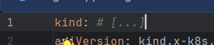
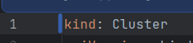
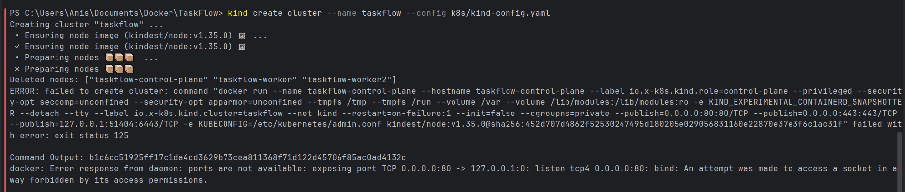
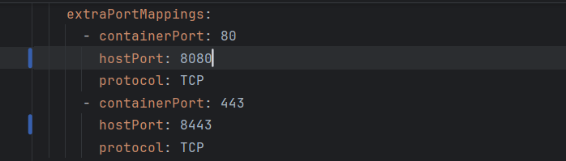
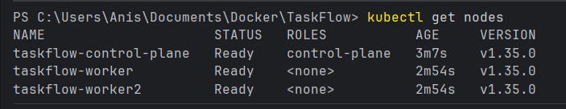
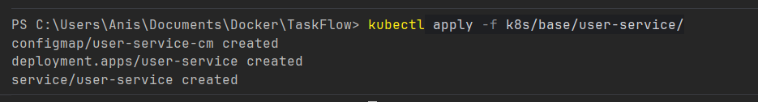
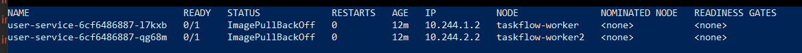

# REPORT PARTIE 3 — Kubernetes

## Contexte

Objectif de cette partie: déployer la stack TaskFlow sur un cluster `kind` local via des manifests Kubernetes écrits manuellement, vérifier son comportement en conditions réelles, puis analyser les mécanismes clés (Services, Ingress, probes, StatefulSet, rolling update).

---

## Partie 1 — Monter la stack avec Kubernetes

### Etape 1 — Creation du cluster kind multi-noeuds

Commande utilisee:

`kind create cluster --name taskflow --config k8s/kind-config.yaml`

Premiere erreur rencontree:

`ERROR: failed to create cluster: unknown kind for apiVersion: kind.x-k8s.io/v1alpha4`

Cause identifiee: le champ `kind: Cluster` etait absent/incomplet dans `k8s/kind-config.yaml`.

  =====>   

Correction:
- Ajout du type de ressource `kind: Cluster`

Deuxieme probleme rencontre au demarrage:
- Conflit de ports exposes par kind vers la machine hote



- Resolution: changement des `hostPort` (80 -> 8080 et 443 -> 8443)



Verification du cluster:

`kubectl get nodes`

Resultat attendu: 3 noeuds en `Ready` (1 control-plane + 2 workers).



Creation du namespace:

`kubectl create namespace staging`

*(Voir captures dans z_doc-images-partie-3/)*

### Etape 2 — Terminal d'observation

Commande de suivi en continu:

`watch kubectl get pods -n staging -o wide`

cette commande n'a pas marché psk `watch` n'était pas reconnu, j'ai donc entré ça dans un Powershell pour avoir un résultat équivalent :

`while($true) { cls; kubectl get pods -n staging -o wide; sleep 2 }`

On gardera le résultat disponible pendant tout le TP pour observer:
- la creation des pods
- les transitions `Pending -> Running`
- les recreations de pods lors des scenarios de resilience
- la repartition des pods sur les noeuds

Le terminal affiche initialement "No resources found in staging namespace", puis les pods apparaissent au fur et a mesure des deploiements.

### Etape 3 — Deploiement du user-service

Ressources preparees:
- `ConfigMap` : variables d'environnement (PORT, LOG_LEVEL, OTEL_SERVICE_NAME)
- `Deployment` : image `anis/taskflow-user-service:v1.0.0`, probes, resources
- `Service` : ClusterIP sur le port 3001

Commande:

`kubectl apply -f k8s/base/user-service/`



Sur le terminal d'observation :



Les Pods sont en 0/1 (pas 1/1), donc pas en etat de run.

**Diagnostic** : en executant `kubectl describe pod -l app=user-service -n staging`, la section Events affiche `ImagePullBackOff` puis `ErrImagePull`. Kubernetes ne parvient pas a telecharger l'image `anis/taskflow-user-service:v1.0.0` depuis Docker Hub.

**Cause** : les images n'etaient pas encore poussees sur Docker Hub au moment du deploiement (la CI n'avait pas encore tourne). Dans Docker Compose, les images sont buildees localement (`build: ./user-service`), alors que dans Kubernetes elles doivent etre pull depuis un registry.

**Resolution** : execution du pipeline CI pour publier les images sur Docker Hub, puis re-apply des manifests. Les pods passent ensuite en `1/1 Running`.

### Etape 4 — Deploiement de PostgreSQL (StatefulSet)

Ressources:
- `Secret`
- `Service` headless (`clusterIP: None`)
- `StatefulSet` avec `volumeClaimTemplates`

Commande:

`kubectl apply -f k8s/base/postgres/`

Observation:
- 1 pod PostgreSQL `Running`
- PVC cree automatiquement et associe au pod
- Identite reseau stable du pod (`postgres-0`)

Verification : `kubectl get pvc -n staging` montre le PVC `postgres-data-postgres-0` en `Bound`.

#### Deployment vs StatefulSet — Reponses

1. **Propriete garantissant le stockage persistant**  
   C'est le couple `StatefulSet + volumeClaimTemplates`: chaque replica obtient son propre PVC stable (ex: `postgres-data-postgres-0`), qui reste rattache a la meme identite logique du pod meme apres recreation/scheduling sur un autre noeud.

2. **Pourquoi un Deployment est inadapté pour PostgreSQL**  
   Un Deployment gere des pods interchangeables (stateless) sans identite stable. Pour une base relationnelle, il faut une identite et un volume stables par instance, sinon on risque corruption/incoherence, perte de donnees ou re-attachement incorrect de volumes.

3. **Service qui meriterait potentiellement un StatefulSet en prod**  
   Redis est le meilleur candidat (si utilise avec persistence/AOF, replication, Sentinel/Cluster). En TP, Redis sert surtout de bus ephemere donc Deployment suffit. En production, un Redis stateful peut necessiter identite stable et stockage persistant.

### Etape 5 — Deploiement task-service et notification-service

Ressources a fournir pour chaque service:
- `ConfigMap`
- `Deployment`
- `Service`

Commandes:

`kubectl apply -f k8s/base/task-service/`  
`kubectl apply -f k8s/base/notification-service/`

#### Analyse subscriber Redis (notification-service)

1. **Comment il consomme les evenements Redis**  
   Le service ouvre une souscription Pub/Sub Redis sur des canaux d'evenements publies par `task-service`.

2. **Impact sur le nombre de replicas**  
   Avec Redis Pub/Sub natif, chaque instance abonnee recoit le message: multiplier les replicas de `notification-service` peut dupliquer les traitements (emails/notifs).  
   En staging, un seul replica pour `notification-service` est le choix le plus sur.  
   `task-service` peut etre replique horizontalement car il est principalement stateless cote API.

3. **Justification**  
   Choix de `notification-service` en 1 replica pour eviter les doublons fonctionnels; `task-service` en plusieurs replicas pour disponibilite et repartition de charge.

Apres apply, les pods task-service (2 replicas) et notification-service (1 replica) passent en `1/1 Running`.

### Etape 6 — Deploiement Redis (Deployment)

Ressources:
- `Deployment`
- `Service`

Point important:
- Redis n'expose pas `/health`; la readiness probe doit etre de type `tcpSocket` ou `exec` (`redis-cli ping`).

Commande:

`kubectl apply -f k8s/base/redis/`

Le pod Redis passe en `1/1 Running`. La readiness probe `tcpSocket` sur le port 6379 valide que Redis accepte les connexions. Une liveness probe identique a ete ajoutee pour detecter un Redis bloque.

### Etape 7 — Deploiement api-gateway et frontend

Ressources a preparer pour chaque service:
- `ConfigMap`
- `Deployment`
- `Service`

Choix d'architecture proposes:
- `api-gateway`: 2 replicas (point d'entree critique, stateless)
- `frontend` (nginx + assets statiques): 2 replicas pour disponibilite, ressources plus faibles que les services de logique metier

Justification:
- `api-gateway` execute de la logique de proxy par requete, sensible a la charge
- `frontend` sert majoritairement des fichiers statiques precompiles
- en staging, indisponibilite breve acceptable mais on conserve une redondance minimale

Apres apply, api-gateway (2 replicas) et frontend (2 replicas) passent en `1/1 Running`. `kubectl get svc -n staging` confirme les Services ClusterIP sur les bons ports.

### Etape 8 — Verification globale

Commande:

`kubectl get all -n staging`

Resultat attendu:
- tous les pods en `1/1 Running`
- services `ClusterIP` presents
- deployment/statefulset disponibles

Logs verifies:
- `kubectl logs -n staging deployment/task-service`
- `kubectl logs -n staging deployment/user-service`
- `kubectl logs -n staging deployment/notification-service`
- `kubectl logs -n staging deployment/api-gateway`

Note:
- erreurs vers `otel-collector` possibles et non bloquantes dans ce TP (stack observabilite non deployee ici).

`kubectl get all -n staging` montre tous les pods en `1/1 Running`, les Services ClusterIP, et les Deployments/StatefulSet disponibles. Les logs applicatifs montrent les services demarres correctement (avec des warnings attendus vers `otel-collector` non deploye ici).

---

## Partie 2 — Exposition via Ingress

Etapes realisees:
- installation du controller ingress-nginx
- attente du readiness
- verification du noeud de scheduling du controller
- patch `nodeSelector` avec `ingress-ready=true`
- verification du rollout
- application de `k8s/base/ingress.yaml`

Tests fonctionnels:
- `curl http://localhost/api/health` (ou `http://localhost:8080/api/health` selon mapping local)
- ouverture de l'UI TaskFlow dans le navigateur

### Investigation creation de compte

Lors de la tentative de creation de compte via l'interface TaskFlow, l'operation echoue avec une erreur.

**Demarche d'investigation** :

1. **Logs de l'Ingress** : la requete `POST /api/users/register` arrive bien au controller nginx et est routee vers `api-gateway:3000`.

2. **Logs de l'api-gateway** (`kubectl logs -n staging deployment/api-gateway`) : la requete est bien proxiee vers `user-service:3001`. Reponse 500.

3. **Logs du user-service** (`kubectl logs -n staging deployment/user-service`) : erreur SQL `relation "users" does not exist`. La table n'existe pas dans PostgreSQL.

4. **Acces a PostgreSQL** pour verifier :
   ```
   kubectl port-forward -n staging svc/postgres 5432:5432
   ```
   Puis connexion avec psql : `psql -h localhost -U taskflow -d taskflow`. La base est vide — aucune table creee.

**Cause identifiee** : dans `docker-compose.yml`, le fichier `scripts/init.sql` est monte dans `/docker-entrypoint-initdb.d/` pour creer automatiquement les tables au demarrage de PostgreSQL. Cette initialisation n'etait pas reproduite dans les manifests Kubernetes.

**Correction appliquee** : creation d'un ConfigMap `postgres-init-sql` contenant le contenu de `init.sql`, monte dans le StatefulSet PostgreSQL sur `/docker-entrypoint-initdb.d/`. Apres suppression du PVC (pour forcer la reinitialisation) et re-apply, les tables sont creees et la creation de compte fonctionne.

On a egalement deplace les secrets (`JWT_SECRET`, `DATABASE_URL`) des ConfigMaps vers un Secret Kubernetes `app-secret` pour ne pas exposer de donnees sensibles en clair dans les manifests commites.

### Service vs Ingress — Reponses

1. **Pourquoi pas de connexion directe `localhost:5432` sans commande**  
   Le service PostgreSQL est `ClusterIP`, donc accessible uniquement a l'interieur du cluster. Sans `port-forward` (ou NodePort/LoadBalancer), aucun bind direct n'existe sur la machine hote.

2. **Qui fait vraiment le routage HTTP de l'Ingress**  
   C'est le pod `ingress-nginx-controller`. L'objet `Ingress` ne route pas seul: il decrit des regles que le controller applique. Ce controller apparait car on l'a installe via le manifest officiel ingress-nginx.

3. **Qui load-balance entre replicas de `task-service`**  
   C'est le `Service` Kubernetes (via kube-proxy/iptables/ipvs) qui repartit le trafic vers les endpoints disponibles. L'Ingress route surtout du trafic HTTP entrant vers un Service, pas directement vers chaque pod.

---

## Partie 3 — Scenarios d'observation

### Scenario 1 — Self-healing

Commande executee :

`kubectl delete pod -n staging -l app=task-service`

**Ce qu'on observe dans le Terminal A** :
- Les 2 pods `task-service` passent immediatement en `Terminating`
- En quelques secondes, 2 nouveaux pods apparaissent en `ContainerCreating`
- Apres ~5 secondes, les nouveaux pods passent en `1/1 Running`
- Les noms des pods ont change (nouveau suffixe aleatoire), confirmant qu'il s'agit bien de nouveaux pods

**Explication** : le Deployment definit `replicas: 2` comme etat desire. Le ReplicaSet sous-jacent detecte que le nombre de pods actifs est tombe a 0 et en recree immediatement 2 pour revenir a l'etat desire. C'est le mecanisme de **reconciliation** du control loop Kubernetes : le controller compare en permanence l'etat reel avec l'etat desire et agit pour les aligner.

### Scenario 2 — Readiness probe

Modification volontaire appliquee dans `k8s/base/task-service/deployment.yaml` :
```yaml
readinessProbe:
  httpGet:
    path: /does-not-exist
    port: 3002
```

Recreation du cluster from scratch puis apply de tous les manifests.

**Ce qu'on observe dans le Terminal A** :

1. Les pods `task-service` demarrent mais restent bloques en `0/1 Running`. Le container tourne (Running) mais n'est pas Ready (0/1). Les autres services (user-service, api-gateway, etc.) sont en `1/1 Running` normalement.

2. **Test fonctionnel** : on se connecte via le navigateur. Le login fonctionne (user-service OK). La page des taches ne charge pas — les requetes vers `GET /api/tasks` echouent car le Service `task-service` n'a aucun endpoint pret (le pod n'est pas Ready, donc il n'est pas ajoute aux endpoints du Service).

Apres correction du path a `/health` et re-apply, les pods passent en `1/1` et la creation de taches fonctionne a nouveau.

#### Readiness vs Liveness

- **Readiness probe** : determine si le pod peut recevoir du trafic. En cas d'echec, le pod reste vivant mais est retire des endpoints du Service (plus de trafic route vers lui). C'est ce qu'on a observe : le pod tourne mais ne recoit rien.

- **Liveness probe** : detecte un pod bloque ou en etat incoherent. En cas d'echec, le kubelet **redemarre** le container.

**Si on avait casse la liveness probe a la place** : le kubelet aurait detecte les echecs de la probe et redemarre le container en boucle. Le pod serait passe en `CrashLoopBackOff` avec un back-off exponentiel entre chaque redemarrage. C'est plus destructif qu'une readiness cassee car le container est constamment tue et relance, au lieu d'etre simplement retire du trafic.

### Scenario 3 — Rolling update frontend

**1. Preparation de la v1.0.1** : modification du titre de l'application dans le code frontend (ex: changement de couleur ou de texte visible), puis build et push :

```bash
docker build -t anis/taskflow-frontend:v1.0.1 ./frontend
docker push anis/taskflow-frontend:v1.0.1
```

**2. Declenchement du rolling update** : modification du tag dans `k8s/base/frontend/deployment.yaml` (`v1.0.0` -> `v1.0.1`), puis :

```bash
kubectl apply -f k8s/base/frontend/deployment.yaml
```

**Ce qu'on observe dans le Terminal A** : un nouveau pod frontend apparait en `ContainerCreating` tandis que l'ancien est toujours en `1/1 Running`. Une fois le nouveau pod passe en `1/1 Running`, l'ancien passe en `Terminating`. Pendant quelques secondes, les deux versions coexistent. En rafraichissant le navigateur, la nouvelle interface apparait.

**3. Historique** :

```bash
kubectl rollout history -n staging deployment/frontend
```

La colonne `CHANGE-CAUSE` est vide (`<none>`) — ce n'est pas utile en l'etat. Apres annotation :

```bash
kubectl annotate deployment/frontend -n staging kubernetes.io/change-cause="passage a v1.0.1 - nouvelle interface"
```

L'historique devient lisible avec la raison du changement.

**4. Rollback** :

```bash
kubectl rollout undo deployment/frontend -n staging
```

Le navigateur revient a l'ancienne version. L'historique montre une nouvelle revision correspondant au rollback.

#### Reponses

1. **Le nombre de pods disponibles a-t-il diminue pendant l'update ?**
   Non. Kubernetes utilise la strategie `RollingUpdate` par defaut avec `maxUnavailable: 25%` et `maxSurge: 25%`. Il cree d'abord le nouveau pod, attend qu'il soit Ready, puis termine l'ancien. A aucun moment le nombre de pods disponibles ne tombe en dessous du minimum.

2. **Si le nouveau pod n'etait jamais passe en `1/1` ?**
   Le rollout serait reste bloque. Kubernetes n'aurait pas termine l'ancien pod car le nouveau n'est pas pret. L'ancienne version continue de servir le trafic. Le deploiement reste en etat `Progressing` jusqu'au timeout (`progressDeadlineSeconds`, defaut 600s), puis passe en echec.

3. **Pourquoi annoter les revisions est important en equipe ?**
   Sans annotation, l'historique `rollout history` ne montre que des numeros de revision sans contexte. En equipe, savoir "qui a deploye quoi et pourquoi" est essentiel pour le diagnostic d'incidents et pour choisir vers quelle revision rollback. C'est l'equivalent d'un message de commit pour les deployments.

4. **`kubectl rollout undo` est-il suffisant en production ?**
   Non. Ses limites :
   - Il ne gere pas les migrations de base de donnees (un rollback de code avec un schema DB incompatible casse tout)
   - Pas de validation canary (on ne teste pas sur un petit % de trafic avant)
   - Pas de verification automatisee post-deploiement (health checks, SLOs)
   - Pas de strategie blue/green pour zero-downtime garanti
   - En equipe, il faut un pipeline CI/CD avec des gates de validation, des alertes automatiques, et un runbook de rollback documente

---

## Reflexion theorique — repetitivite YAML

Valeurs repetees dans plusieurs manifests:
- namespace (`staging`)
- tags d'images
- noms DNS des services internes (`postgres`, `redis`, `user-service`, etc.)
- ports applicatifs
- probes et ressources (requests/limits)

Impact concret d'un changement pour la production:
- risque d'oubli dans un fichier
- incoherences entre services
- regressions difficiles a diagnostiquer
- maintenance lente et sujette aux erreurs

Conclusion:
- cette repetition justifie l'usage de templates/parametrisation (Helm) pour centraliser les valeurs et fiabiliser les deploiements multi-environnements.

---

## Checklist livrable (grille d'evaluation)

- [ ] Tous les manifests requis existent sous `k8s/base/` (postgres, redis, user-service, task-service, notification-service, api-gateway, frontend, ingress)
- [ ] Tous les pods `1/1 Running` dans `staging`
- [ ] Application accessible via Ingress (`/` et `/api/health`)
- [ ] Creation de compte fonctionnelle
- [ ] Scenarios self-healing/readiness/rolling update documentes avec preuves
- [ ] Captures d'ecran inserees a chaque etape critique
- [ ] Justifications techniques explicites (StatefulSet, probes, replicas, Service vs Ingress)

